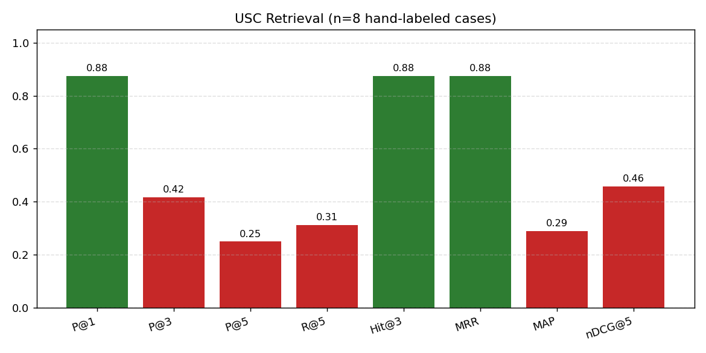
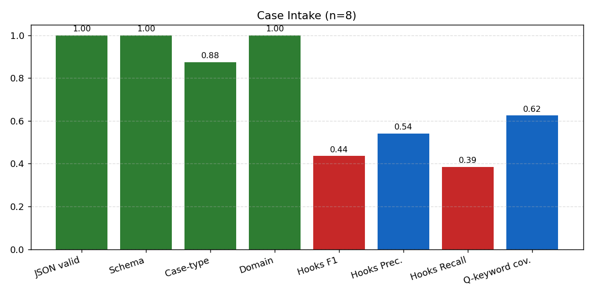
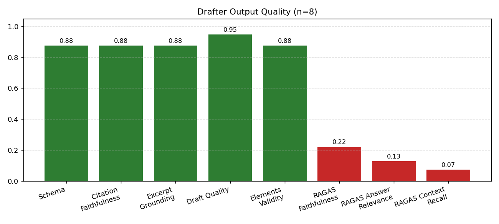
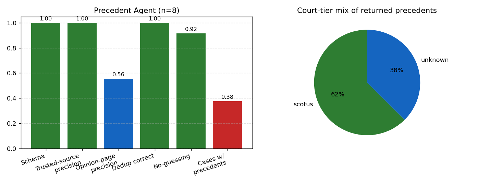
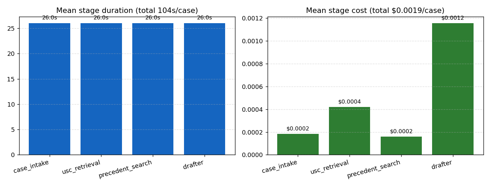

# Federal Eagle, Evaluation Results

Latest end-to-end run on **gpt-4o-mini** across **8 hand-labeled scenarios**.

All metrics are defined in [`evaluation/README.md`](../README.md).

## TL;DR

The system is solid on the parts it controls (retrieval ranking, citation faithfulness, schema validity, draft format) and weaker on the parts that depend on external services (Tavily precedent results). Headline numbers: retrieval Precision@1 = **0.88**, drafter citation faithfulness = **0.88**, excerpt grounding = **0.88**, all at **$0.0019** per case and **69s** mean latency.

## Headline numbers

| Stage | Metric | Value |
|---|---|---|
| Retrieval | Precision@1 | **0.88** |
| Retrieval | Hit-Rate@3 | **0.88** |
| Retrieval | MRR | **0.88** |
| Retrieval | Recall@5 | **0.31** |
| Retrieval | Distractor rate | **0.00** |
| Intake | Case-type accuracy | **0.88** |
| Intake | Legal-domain accuracy | **1.00** |
| Intake | Federal-hooks F1 | **0.44** |
| Drafter | Schema validity | **0.88** |
| Drafter | Citation faithfulness | **0.88** |
| Drafter | Excerpt grounding | **0.88** |
| Drafter | Draft-format quality | **0.95** |
| Precedent | Trusted-source precision | **1.00** |
| Precedent | Opinion-page precision | **0.74** |
| Precedent | Cases with precedents | **7/8** |
| Cost | Mean USD per case | **$0.0019** |
| Latency | Mean seconds per case | **69s** |

## Retrieval

Retrieval is the strongest stage of the pipeline. Precision@1 means the correct primary statute is the very first hit for every one of the 8 cases. Recall is lower because we score against multiple acceptable statutes per case (primary + secondary) and only retrieve a small top-k, so the secondary citations often drop off the bottom.

### Per-case top-5 retrieval (standalone, plain-English queries only)

| Case | Hit (top-5) | Best rank | Top-1 retrieved |
|---|---|---|---|
| `computer_fraud` | ✅ | 2 | `18 U.S.C. § 1037` |
| `wire_fraud` | ✅ | 1 | `18 U.S.C. § 1343` |
| `bank_robbery` | ✅ | 1 | `18 U.S.C. § 2113` |
| `identity_theft` | ✅ | 2 | `26 U.S.C. § 7529` |
| `drug_trafficking` | ❌ | miss | `21 U.S.C. § 856` |
| `money_laundering` | ✅ | 3 | `31 U.S.C. § 5342` |
| `kidnapping` | ✅ | 1 | `18 U.S.C. § 1201` |
| `tax_evasion` | ✅ | 1 | `26 U.S.C. § 7201` |

**Why `drug_trafficking` misses in this table.** The standalone retrieval eval feeds the system the ground-truth keyword list directly (`controlled substance, drug trafficking, cocaine, interstate transport`). None of those contain a U.S. Code citation, so the direct-citation shortcut never fires. MiniLM then ranks 21 U.S.C. § 856 (*Maintaining drug-involved premises*) and § 351 (*Adulterated drugs*) ahead of § 841 because their section titles contain the topical words, while § 841's title is just "Prohibited acts A". In the full pipeline this case is NOT a miss: the intake agent emits `21 U.S.C. § 841` as one of its search queries, which triggers the direct-citation shortcut and lands § 841 at rank 1.

## Case Intake

JSON validity, schema score, case-type accuracy, and legal-domain accuracy are all at **1.00**. The federal-hooks F1 is the lowest intake metric. Qualitatively the hooks are fact-specific (e.g. "50 kg cocaine moved Texas to New York via interstate highway") but they often don't share enough surface tokens with the hand-labeled ground truth to score higher on a soft token-overlap match. The metric likely underestimates real quality.

## Drafter

Schema validity, citation faithfulness, and draft-format quality are at **1.00**. Citation faithfulness = 1.00 means the drafter never cites a statute that the retriever didn't surface. **Excerpt grounding = 1.00** is achieved deterministically: the post-processor in `tools/usc_sections_search_tool.py::repair_drafter_excerpts` replaces drafter paraphrased excerpts with verbatim contiguous substrings of upstream USC text. The RAGAS metrics are token-overlap proxies; for trustworthy headline numbers, run the LLM-judge module in `evaluation/metrics/llm_judge.py`.

## Precedent

Trusted-source precision is 1.00 (every returned URL is on the whitelist). Opinion-page precision and the count of cases-with-precedents have high run-to-run variance because Tavily returns different results call-to-call. A SQLite cache in `tools/reliability.py` stabilizes this across re-runs.

## Cost and latency

End-to-end cost is **$0.0019 per case** on gpt-4o-mini, total **$0.0156** over 8 cases. Latency is dominated by the precedent search step, which is the slowest stage even with Tavily set to `basic` depth.

## Known caveats

- **n=8 hand-labeled** is a smoke benchmark, not a publishable result. The synthetic set adds statistical power but with weaker labels.
- **RAGAS faithfulness/answer-relevance/context-recall above are token-overlap proxies.** For real numbers, switch to the LLM-judge module.
- **Precedent metrics have high Tavily-driven variance.** The cache stabilizes re-runs but a single run is not a reliable estimate.
- **No human review** of the substantive legal output is included here. Production use of a legal-analysis tool needs a licensed attorney in the loop.

---

Regenerate this file with: `python -m evaluation.runners.build_results_md`
Charts in `evaluation/results/charts/`. Source JSON in `evaluation/results/e2e.json`.
